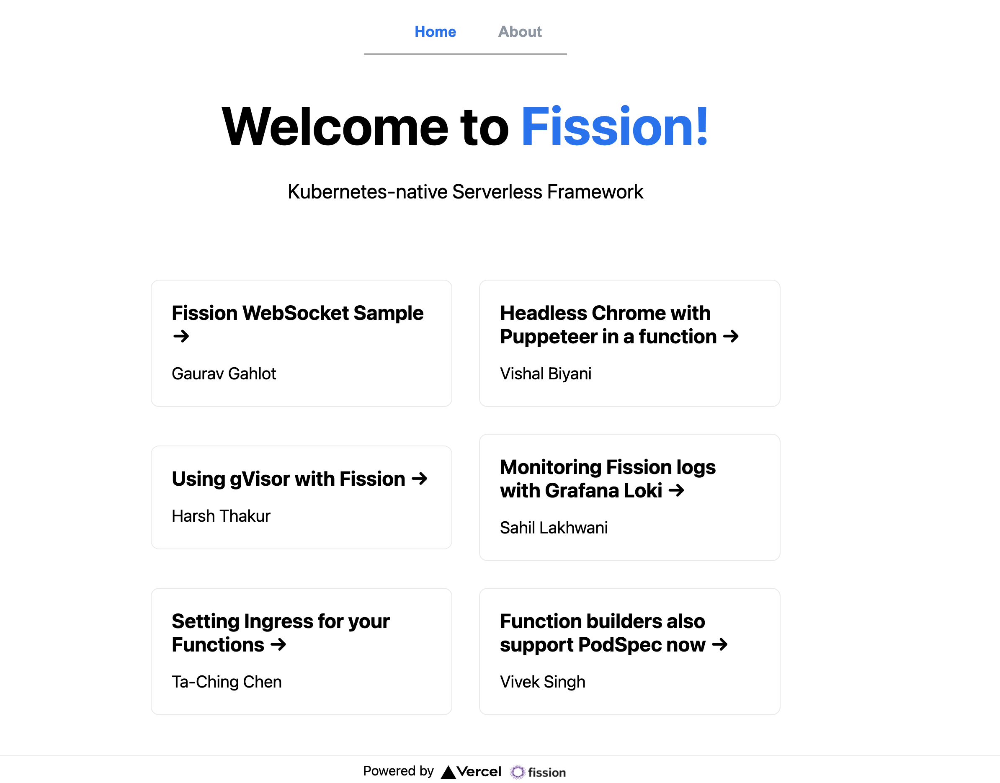

# Blog Demo with Next.js and Fission



This sample shows a demo blog using Fission function handling multiple URLs with prefix path.
With this way, we can see a demo webapp running with Fission.

We also handle multiple HTTP verbs from same route in this example.
Please check [deploy/specs](./deploy/specs) directory for the Fission specs.

For Specs related commands, please refer [Specs Generation commands](deploy/specs/README.md#spec-generation)

This examples uses [entrypoint](app.js) which loads NextJs app as Fission function with routing capabilities.

## Deploy

- Build NodeJS app and create Fission deployment package
- Fission function and HTTP route

Note:

- This example uses modified NodeJS environment, available in Fission default NodeJS environment.
- Please ensure you are using environment NodeJS version for this example as per local version(recommended NodeJs 16).

```bash
./deploy/build.sh
```

## Use

Visit the browser,

```sh
http://<router-url>/nextapp
```

Using fission CLI,

```bash
fission function test --name nextjs-func --subpath '/nextapp'
fission function test --name nextjs-func --subpath '/nextapp/chrome-puppeteer-function'
fission function test --name nextjs-func --subpath '/nextapp/api/blogs/chrome-puppeteer-function'
```

Using curl,

```bash
kubectl port-forward svc/router 8888:80 -nfission
curl localhost:8888/nextapp
curl localhost:8888/nextapp/chrome-puppeteer-function
curl localhost:8888/nextapp/api/blogs/chrome-puppeteer-function
```

## Cleanup

```bash
./deploy/destroy.sh
```
